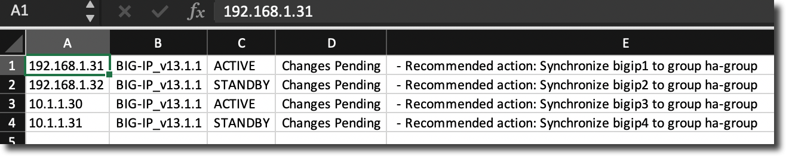

# F5 Utils

I am planning to add series of handy utlity scripts for managing F5 devices. These are intented to run from terminal window. the python scripts can run in windows command-line or mac terminal as long as python is installed on the system.

## F5 HA Pair devices Synchronization Statuses
This script will enumerate through the list of given management-IPs/host names of the devices and gathers sync state, and version information in an csv output. The out may be viewed in Excel. The below is the usage for running script:

`get_devices_sync_state -u user_id -f devices.lst`

Here is the sample outpu:

